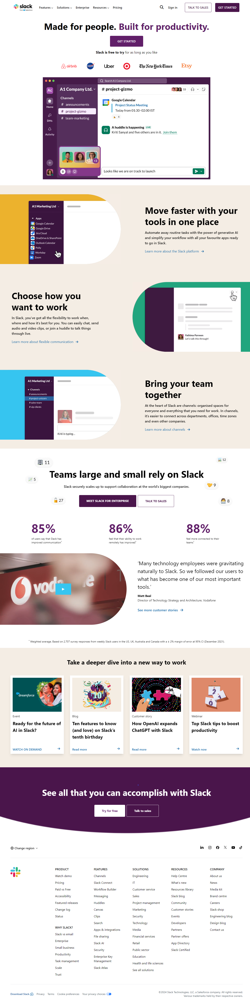

# Slack Home Page Clone

This project is a clone of the Slack website home page created using HTML, Tailwind CSS, and JavaScript. It replicates the layout and styling of the original Slack home page, providing the same visually appealing design.

## Live Demo

[Slack Website Clone](https://slack-clone-six-azure.vercel.app/)

## Technologies Used

- HTML: For the structure of the web page.
- Tailwind CSS: For styling and layout.
- JavaScript: For adding interactivity.

## Project Screenshot

